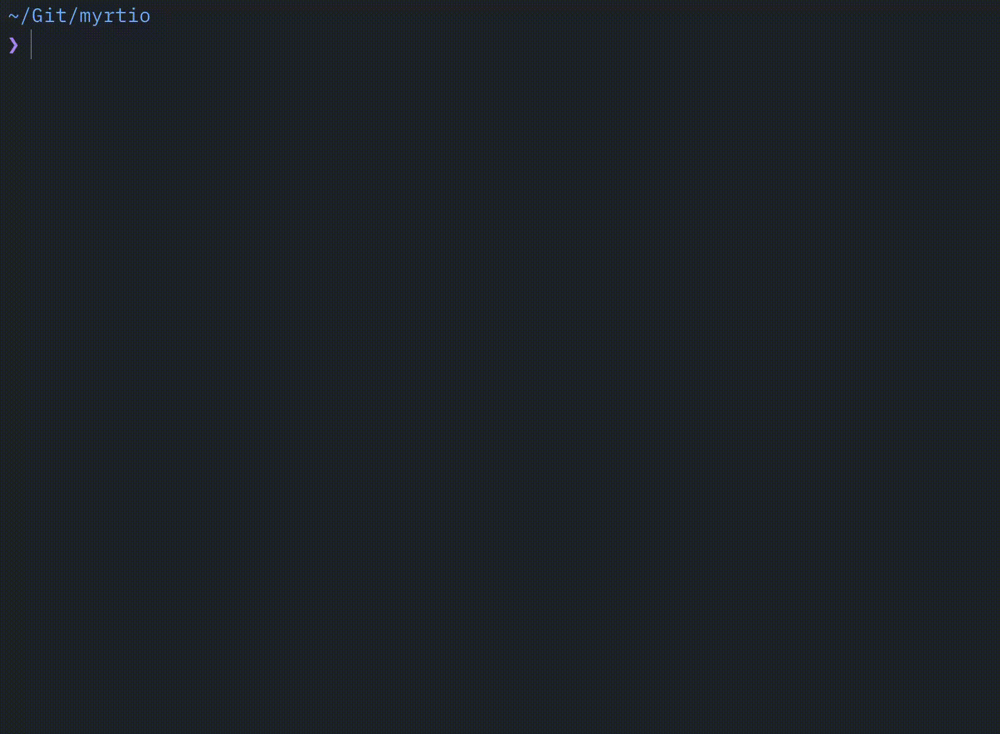

<p align="center">
    
</p>

<h1 align="center">repomop</h1>

<p align="center">
  <a href="https://github.com/mishamyrt/repomop/actions/workflows/ci.yml">
    
  </a>
</p>


Developers accumulate projects over time. Each one carries build artifacts and dependency caches that are trivially re-created, yet quietly eat gigabytes of disk space. A single Rust or Swift project can hold over a gigabyte in its build directory alone. Multiply that by dozens of repos and the waste adds up fast.

**repomop** scans your projects folder, finds these artifacts, and lets you clean them up in one shot through a friendly interactive interface.

## How It Works

1. Scans a directory recursively for known build and dependency artifacts.
2. Calculates the size of each one.
3. Presents an interactive list where you pick what to remove.
4. Asks for confirmation, then deletes the selected directories.

<p align="center">
  
</p>

## Supported Ecosystems

| Ecosystem | Detected artifacts |
|---|---|
| JavaScript / Node.js | `node_modules` (with pnpm hard links handling) |
| Rust | `target` |
| Swift (SPM) | `.build` |
| Elixir | `_build`, `deps` |
| Haskell | `.stack-work`, `dist-newstyle` |
| Terraform | `.terraform` |
| Python | virtualenvs (any directory name) |
| Java / Kotlin (Gradle) | `.gradle`, `build`, `out` |
| Java (Maven) | `target` |
| C / C++ (CMake) | `build`, `cmake-build-*`, `CMakeFiles` |
| Dart / Flutter | `.dart_tool`, `build` |
| Ruby | `.bundle`, `vendor/bundle` |
| PHP | `vendor` |
| Zig | `zig-out`, `.zig-cache` |
| PlatformIO | `.pio` |

Each rule is tied to a project marker file or file pattern (e.g. `Cargo.toml` for Rust, `*.tf` for Terraform), so random directories with the same name won't be misidentified.

## Installation

```bash
curl -fsSL https://raw.githubusercontent.com/mishamyrt/repomop/master/install.sh | sh
```

By default the binary is placed in `$HOME/.local/bin`. To change the destination:

```bash
curl -fsSL https://raw.githubusercontent.com/mishamyrt/repomop/master/install.sh | INSTALL_DIR=/usr/local/bin sh
```

To install a specific version:

```bash
curl -fsSL https://raw.githubusercontent.com/mishamyrt/repomop/master/install.sh | VERSION=v0.1.0 sh
```

## Usage

Navigate to the directory that contains your projects and run:

```bash
repomop
```

You can also point it at a specific path:

```bash
repomop --path ~/Projects
```

### Options

| Flag | Description |
|---|---|
| `--path` | Root directory to scan (defaults to the current directory) |
| `--max-depth` | Maximum traversal depth (`-1` for unlimited) |
| `--dry-run` | List found artifacts without deleting anything |
| `--yes` | Skip confirmation and delete all found artifacts |

### Controls

| Key | Action |
|---|---|
| `Up` / `Down` or `k` / `j` | Move through the artifact list and the confirmation list |
| `Space` | Select / deselect an item |
| `Enter` | Proceed to confirmation from the selection list |
| `y` | Confirm deletion |
| `n` or `Esc` | Cancel and return to the list |
| `q` or `Ctrl+C` | Quit |

On the confirmation screen, `Enter` is intentionally ignored to avoid accidental cancellation.

> **Warning:** Deletion is permanent. Selected directories are removed with `os.RemoveAll`.
